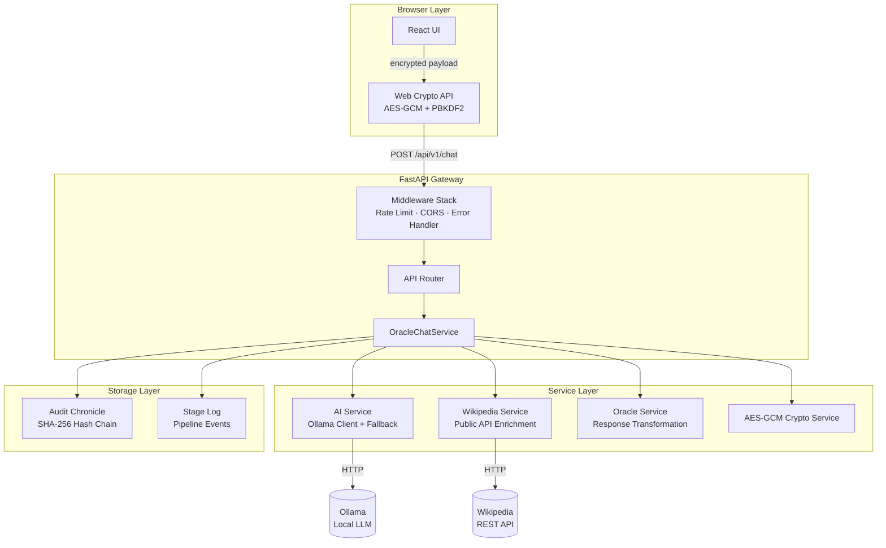
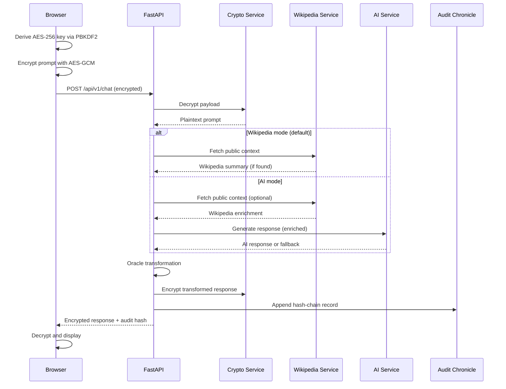

# Cipher Oracle Gateway

**Privacy-first AI gateway with client-side encryption, local inference, and tamper-evident audit logging.**

Cipher Oracle is a zero-trust AI proxy that ensures no server ever sees plaintext prompts or responses. Messages are encrypted in the browser using AES-GCM, decrypted transiently for processing, and re-encrypted before returning. Every interaction is recorded in a SHA-256 hash chain for tamper-evident auditability. Designed as a production-style engineering artifact: layered architecture, deterministic test suite, and minimal external dependencies.

---

## Architecture



### Request Lifecycle



---

## Core Features

- **Client-side AES-GCM encryption** — prompts and responses encrypted in the browser before transport. Server operates on ciphertext only.
- **PBKDF2 key derivation** — encryption key derived from user passphrase (SHA-256, 100k+ iterations). No static shared secret at rest in the frontend.
- **Dual processing modes** — `wikipedia_only` (default, no AI dependency) or `ai` (local Ollama inference with optional Wikipedia enrichment).
- **Local LLM integration** — Ollama-backed inference. Graceful fallback when unavailable. No cloud AI provider required.
- **Wikipedia public API enrichment** — factual context injected when queries match known topics. Best-effort, non-blocking.
- **SHA-256 audit hash chain** — every request/response appended to an immutable, tamper-evident chain. Previous-hash linkage prevents undetected modification.
- **Stage-level processing logs** — per-request pipeline events (decrypt, enrich, infer, transform, encrypt, audit) with timestamps and status.
- **Oracle transformation layer** — lightweight response wrapping with randomly selected mystical lead-ins. Demonstrates layered service composition.
- **Rate limiting** — 100 requests per minute per IP. In-memory sliding window.
- **Consistent error envelope** — all errors return `{"status": "error", "error": "..."}`. Validation failures include field-level details.

---

## System Design

### Layered Architecture

The gateway is organized into four layers, each with a single responsibility:

| Layer | Components | Responsibility |
|-------|-----------|----------------|
| **Transport** | FastAPI + Uvicorn | HTTP routing, middleware, error handling |
| **Orchestration** | `OracleChatService` | Request lifecycle: decrypt → enrich → infer → transform → encrypt → audit |
| **Service** | AI, Wikipedia, Oracle, Crypto | Stateless business logic with defined interfaces |
| **Storage** | Audit hash chain, stage logs | Append-only file-based persistence |

### Encryption Model

Two encryption paths exist:

1. **Shared-key mode** — a base64-encoded 32-byte AES key configured server-side via `GATEWAY_SHARED_KEY_BASE64`. Used by both frontend and backend. Validated at startup; refuses insecure defaults in production.

2. **Passphrase-derived mode** — user provides a passphrase. Frontend derives an AES-256 key using PBKDF2 (SHA-256, 100k+ iterations, random salt). Salt is stored in session storage and sent with each request. Backend derives the same key to decrypt. The passphrase itself is never transmitted or stored.

Both paths use AES-GCM with a fresh 12-byte nonce per encryption operation. Backend plaintext is explicitly zeroed after use.

### Audit Hash Chain

Each audit record contains:

```json
{
  "timestamp": "2026-04-11T12:00:00+00:00",
  "event_type": "oracle_chat",
  "payload": {
    "request_preview": "sha256:a1b2c3",
    "response_preview": "sha256:d4e5f6"
  },
  "previous_hash": "<SHA-256 of prior record>",
  "hash": "<SHA-256 of this record>"
}
```

The chain is append-only. Any modification to a past record changes its hash and breaks all subsequent linkages. The `previous_hash` field enables external verification without server cooperation.

### Wikipedia Integration

The Wikipedia service uses a multi-strategy approach:
1. **Direct fetch** by extracted topic title
2. **Search fallback** via `opensearch` API if direct fetch fails
3. **Topic extraction** from natural language prefixes (`what is`, `who is`, `tell me about`, etc.)

If no Wikipedia context is found, the system proceeds without enrichment. The fetch is non-blocking; a timeout or HTTP error does not fail the entire request.

---

## API Overview

### POST `/api/v1/chat`

Encrypted chat with the oracle.

**Request:**

```json
{
  "encrypted": {
    "nonce": "base64-12-byte-iv",
    "ciphertext": "base64-aes-gcm-ciphertext"
  },
  "request_id": "optional-uuid",
  "mode": "wikipedia_only",
  "passphrase": "optional-user-passphrase",
  "kdf_salt": "optional-base64-salt",
  "kdf_iterations": 100000
}
```

**Response (200):**

```json
{
  "encrypted": {
    "nonce": "base64-iv",
    "ciphertext": "base64-response"
  },
  "audit_hash": "sha256-hex-digest",
  "public_api": { "provider": "wikipedia", "title": "...", "summary": "...", "url": "..." }
}
```

### GET `/api/v1/audit/logs`

Full hash chain in insertion order.

### GET `/api/v1/audit/stages`

Per-request pipeline events. Filters: `?request_id=` and `?limit=`.

### GET `/health`

Liveness probe. Returns `{"status": "ok"}`.

Full OpenAPI documentation available at `/docs` when the server is running.

---

## Testing Strategy

The test suite is designed for deterministic CI/CD execution. All external services are mocked; no network access required.

**Coverage** (27 tests):

| Test File | Focus | Mocks |
|-----------|-------|-------|
| `test_crypto_utils.py` | AES-GCM encrypt/decrypt round-trip, invalid payload rejection | None (pure functions) |
| `test_ai_service.py` | Ollama success, connection error fallback, HTTP error fallback, fallback disabled behavior | `httpx` transport |
| `test_oracle_route.py` | Encrypted round-trip, error mapping, legacy alias, mode propagation | Service layer |
| `test_oracle_chat_service.py` | Full pipeline, error wrapping, Wikipedia inclusion, mode selection | AI, Wikipedia, file I/O |
| `test_oracle_service.py` | Prefix wrapping, empty input handling | None |
| `test_public_api_service.py` | Summary fetch, topic extraction, search fallback | `httpx` transport |
| `test_audit_route.py` | Log retrieval, empty state, filtering, pagination | File I/O |
| `test_middleware.py` | Error envelope, validation details, 404→JSON | FastAPI test client |
| `test_health.py` | Health endpoint | FastAPI test client |

**Why these tests are stable:**
- External HTTP (Ollama, Wikipedia) is mocked at the transport layer
- File-based audit/stage logs use temporary files and isolation per test
- No database, no network, no environment-specific state
- Cryptographic operations are deterministic given fixed inputs

```bash
cd backend
pytest -q     # 27 passed
```

---

## Local Setup

### Prerequisites

- Python 3.12+
- Node.js 20+
- Ollama (optional — falls back gracefully)

### Quick Start

```powershell
.\start.ps1          # Setup only (env files + dependencies)
.\start.ps1 -Run     # Setup + launch dev servers
.\run-dev.ps1        # Start backend + frontend in parallel
```

### Manual Setup

```powershell
# Backend
cd backend
python -m venv .venv
.\.venv\Scripts\Activate.ps1
python -m pip install -r requirements.txt
python -m uvicorn app.main:app --reload --host 127.0.0.1 --port 8000

# Frontend (separate terminal)
cd frontend
npm install
npx vite --host=127.0.0.1 --port=5173
```

### Environment

Copy `backend/.env.example` to `backend/.env`. Key configuration:

| Variable | Default | Purpose |
|----------|---------|---------|
| `OLLAMA_BASE_URL` | `http://localhost:11434` | Local LLM endpoint |
| `OLLAMA_FALLBACK_ENABLED` | `true` | Graceful degradation when Ollama is down |
| `WIKIPEDIA_ENABLED` | `true` | Public API enrichment |
| `GATEWAY_SHARED_KEY_BASE64` | (required) | 32-byte base64 AES key |
| `AUDIT_LOG_PATH` | `data/audit.log` | Hash-chain persistence path |

Generate a strong key:

```powershell
[Convert]::ToBase64String((1..32 | ForEach-Object { Get-Random -Minimum 0 -Maximum 256 }))
```

### Verify

```powershell
cd backend
pytest -q

cd frontend
npm run build
```

Open `http://127.0.0.1:5173` (app) or `http://127.0.0.1:8000/docs` (API docs).

---

## Engineering Highlights

### Idempotency & Error Handling

- `request_id` is client-supplied; the server passes it through stage logs but does not enforce idempotency at the gateway layer (design choice: idempotency belongs at the consumer, not the proxy).
- Consistent error envelope across all endpoints: `{"status": "error", "error": "..."}` with optional `details` for validation failures.
- HTTP exceptions and validation errors caught by exception handlers — no stack traces leaked to clients.
- Rate limiting rejects excess traffic before it reaches the orchestrator.

### Security

- **Encryption at the boundary:** plaintext never exists outside the browser or the ephemeral server process. Not persisted, not logged.
- **Key validation:** startup refuses insecure default keys in production mode (`ALLOW_INSECURE_DEV_KEY=false`).
- **Safe log previews:** audit logs store `sha256:prefix` digests, not raw text. Non-reversible.
- **Passphrase zeroed:** the passphrase string is explicitly `None`-assigned after key derivation in the backend.
- **Memory hygiene:** plaintext variables are `del`-ed after use in the orchestrator.
- **CORS:** restricted to known origins. No wildcard.

### Performance

- Ollama requests have configurable timeout (default 120s) and retry with exponential backoff.
- Wikipedia fetch is bounded (default 8s timeout) and non-fatal on failure.
- File-based audit: O(1) append, O(n) read. Suitable for single-node deployments. For high-throughput, replace with an append-only database.
- Rate limiting uses in-memory sliding window — zero external dependencies.

### Docker Reproducibility

The project uses local virtual environments and pinned dependency files (`requirements.txt`, `package-lock.json`). While there is no Dockerfile in the current revision, the dependency model is designed for containerization:

- Backend: `pip install -r requirements.txt` produces a deterministic environment (pinned versions).
- Frontend: `npm ci` from `package-lock.json` produces identical `node_modules`.
- Runtime state (audit logs) is file-based and can be mounted as a volume.

---

## Design Decisions

### Why FastAPI over Symfony/Laravel

This project is a lightweight API gateway, not a full SaaS backend. FastAPI was chosen for:
- **Async-first:** HTTP calls to Ollama and Wikipedia use `httpx.AsyncClient` — no thread pool overhead.
- **Built-in validation:** Pydantic schemas on every route. No separate serializer layer.
- **Auto-generated OpenAPI docs:** `/docs` endpoint is free. Useful for both development and portfolio review.
- **Minimal surface:** No ORM, no migrations, no admin panel. The gateway does one thing.

### Why Client-Side Encryption

Traditional AI gateways require the server to see plaintext prompts. Cipher Oracle inverts this: the browser encrypts before sending. The server decrypts only for the duration of processing, then re-encrypts. This limits trust requirements to:
- The browser runtime (Web Crypto API)
- The server's in-memory processing (ephemeral, audited)

### Why File-Based Audit Logs

A hash chain needs append-only semantics. A file provides this without a database dependency:
- Simple to verify: `sha256sum` each line
- Simple to backup: copy the file
- Simple to audit: read sequentially

For distributed deployments, replacing the file with an append-only database (Cassandra, Kafka) preserves the same hash-chain semantics.

### Why Wikipedia-Only Default Mode

The default processing mode (`wikipedia_only`) requires no AI infrastructure:
- Works offline without Ollama
- Zero inference cost
- Demonstrates the full pipeline (encrypt → enrich → transform → encrypt → audit) without LLM latency

This makes the project immediately runnable and testable, with AI as an optional enhancement rather than a hard dependency.

### Tradeoffs

| Decision | Tradeoff |
|----------|----------|
| File-based audit | Simple and verifiable, but does not scale to multi-node writes without a distributed log |
| In-memory rate limiting | Stateless and fast, but resets on server restart. Use Redis for sticky rate limits in production |
| Wikipedia-only default | Lower capability ceiling, but zero infrastructure requirements and immediate runnability |
| Passphrase-derived keys | User controls the key, but lost passphrase = lost access. Key escrow is out of scope |
| No database | Eliminates migration risk and operational overhead, but limits query/correlation capability |

---

## Project Structure

```
├── backend/
│   ├── app/
│   │   ├── api/routes/          # FastAPI route handlers
│   │   │   ├── oracle.py        # POST /api/v1/chat
│   │   │   └── audit.py         # GET /api/v1/audit/logs, /stages
│   │   ├── ai/                  # Ollama client + service
│   │   ├── audit/               # Hash-chain + stage log services
│   │   ├── crypto/              # AES-GCM encrypt/decrypt
│   │   ├── core/                # Config, security utilities
│   │   ├── schemas/             # Pydantic request/response models
│   │   ├── services/            # Oracle chat, Wikipedia, transformation
│   │   ├── middleware.py        # Rate limit, error handling
│   │   └── main.py              # FastAPI app factory
│   ├── tests/                   # 27 tests, deterministic
│   ├── data/                    # Audit log runtime directory
│   └── requirements.txt
├── frontend/
│   ├── src/
│   │   ├── components/          # MessageForm, progress panel
│   │   ├── crypto/              # Web Crypto API wrappers
│   │   ├── pages/               # OraclePage, AuditPage
│   │   ├── services/            # HTTP client
│   │   └── types/               # TypeScript interfaces
│   ├── package.json
│   └── vite.config.ts
├── docs/                        # Architecture, API contract, audit schema
└── README.md
```

---

## Verification

```powershell
# Backend tests (deterministic, no network required)
cd backend
pytest -q

# Frontend type-check and build
cd frontend
npm run build

# Plagiarism / clone detection (optional)
.\check-plagiarism.ps1
```

---

## License

MIT
